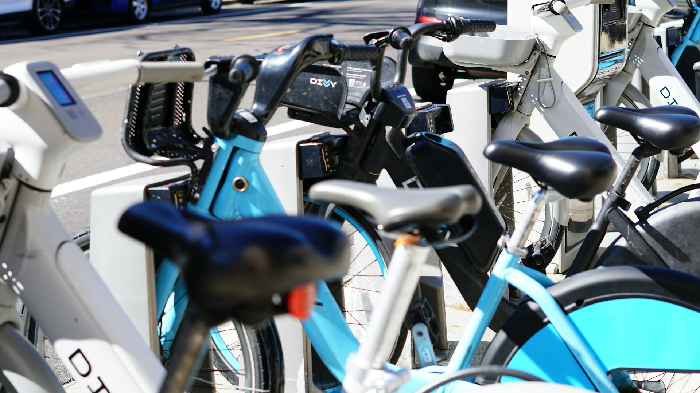

<h1 align="center">Google Cyclistic: Shared Bike Data Analysis</h1>

  
###### *Photo credit: [Cristian Guillen](https://unsplash.com/fr/@cristiang2023)*
 
## Introduction

**This case study was completed as part of the Google Data Analytics Career Certificate program.  
Cyclistic is a fictional company modeled after a real service: the Divvy bike rental service in Chicago.**

This project presents an in-depth analysis of Cyclistic's shared bike trip data.
My primary objective was to understand the behavioral differences between casual riders and annual members, in order to develop effective marketing strategies to convert casual users into annual subscribers. 
Playing the role of a junior data analyst on Cyclistic's marketing analytics team, my goal was to provide data-backed insights and recommendations to maximize annual memberships.

## Business Problem

How do Cyclistic's casual riders and annual members use shared bikes differently, and how can these differences be leveraged to encourage the conversion of casual riders into annual members?

## Data Source

The analysis is based on Cyclistic's historical shared bike trip data *(Chicago Divvy's data)*.

## Tools Used

*   R
*   RStudio
*   ggplot2
*   tidyverse
*   readr
*   Excel
*   ...

## Analysis Methodology

1.  **Data Collection and Cleaning:** acquisition and preparation of raw data for analysis.
2.  **Exploratory Data Analysis (EDA):** data exploration to identify trends, patterns, and anomalies.
3.  **Identification of Behavioral Differences:** comparative analysis of usage habits between casual riders and annual members.
4.  **Data Visualization:** creation of charts and graphs to illustrate key findings.

## Key Findings

My observations reveal two distinct user profiles:

*   **Annual Member:** an active user who primarily uses their bike for daily commuting. Their trips are generally quick, frequent (several times a week), year-round, and predominantly directed towards the city's business center.
*   **Casual Rider:** primarily uses the service on weekends for leisure trips. These rides are typically at a leisurely pace, targeting entertainment and cultural destinations, and occur more frequently in summer than in winter.

These observations highlight significant differences in the frequency, duration, purpose, and seasonality of use between the two groups.

## Marketing Recommendations

Leveraging the established profiles of both casual riders and annual members, I propose several marketing initiatives aimed at encouraging the conversion of casual riders to annual members. Understanding their habits and behaviors facilitates crafting messages that resonate with them.

1.  **Intermediate Weekend Subscription:**
    *   Introduction of a subscription offer specifically for weekend use, more financially attractive than pay-per-use options.
    *   Possibility of offering couple and family versions, with additional benefits.
    *   The goal is to facilitate the transition to a full annual membership by encouraging more frequent use through this intermediate offer.

2.  **Targeted Advertising Campaign:**
    *   Launch of an advertising campaign promoting Cyclistic as an alternative to usual commuting methods.
    *   Display in the busiest stations frequented by casual riders.
    *   Existing users are easier to convince, provided that the friction points hindering their full adoption are identified and addressed through surveys conducted at these same busiest stations.

3.  **Partnerships with Leisure and Cultural Venues:**
    *   Establishment of partnerships with entertainment and cultural venues in the city.
    *   Cyclistic will promote these partners via its app.
    *   In return, partners will offer exclusive discounts, free tickets, or invitations to special events, available exclusively to annual members.
    *   These rewards, aligned with the known interests of casual riders, will more effectively incentivize them to subscribe to the service.

## Full Report

For a detailed analysis, complete visualizations, and conclusions, please refer to the presentation report in this repository:

<h4 align="center"><a href="https://github.com/TonyChamCham/googleDACC_cyclistic/blob/main/Cyclistic%20Transforming%20Casual%20Users%20into%20Subscribers_lowres.pdf">Cyclistic Transforming Casual Users into Subscribers_lowres.pdf</a></h4>

## Author

#### [Antony Champane](antony.champane@outlook.fr)
